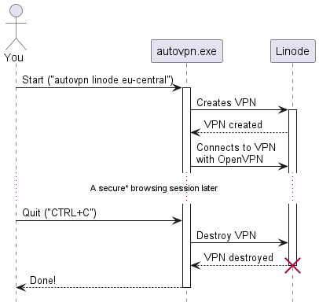

# AutoVPN

A tool for cheaper VPN connections.

This tool provisions single-session VPN servers at a VPS provider. 
When the VPN server is created, it automatically connects to the VPN server and destroys the VPN server when you 
disconnect from the session.



## Table of content
- [1. Setup](#setup)
    - [1.1 Install OpenVPN](#1-install-openvpn)
    - [1.2 Create an account at your chosen provider (currently Linode only)](#2-create-an-account-at-your-chosen-provider-currently-linode-only)
    - [1.3 Download binary](#3-download-binary)
    - [1.4 Unzip archive and run](#4-unzip-archive-and-configure-configyml)
    - [1.5 Run](#5-run)
- [2. Configuration](#configuration)
- [3. Usage](#usage)

# Setup

## 1: Install OpenVPN

OpenVPN is required to connect to the VPN server.

**Note:** This script doesn't support "OpenVPN Connect", you need to install
the "OpenVPN" CLI tool.
If you're on Windows, you should find installers etc. here:
https://openvpn.net/community-downloads/

## 2: Create an account at your chosen provider (currently Linode only)

Go to the provider's website, sign up and generate the required API key(s).

## 3: Download binary

Go to [Releases](https://github.com/Dekamik/autovpn/releases) and download the appropriate binary for your operating
system and architecture.

### Binary types:

|           | Windows | macOS (darwin) | Linux |
|-----------|---------|----------------|-------|
| **386**   | ✔️      | ❌              | ✔️    |
| **amd64** | ✔️      | ✔️             | ✔️    |
| **arm**   | ❌       | ❌              | ✔️    |
| **arm64** | ✔️      | ✔️             | ✔️    |

* 386 = x86, a.k.a. most 32-bit computers
* amd64 = most 64-bit computers
* arm = Smartphone and Raspberry Pi
* arm64 = Smartphone, Raspberry Pi, Apple Silicon (M1, M2 etc.)

## 4: Unzip archive and configure `config.yml`

Copy the `default.config.yml` and setup according to [Configuration](#configuration) below.

## 5: Run

To get started, refer to [Usage](#usage) below, or run `autovpn --help`

# Configuration

Configuration is done through the `config.yml` file. Here is an example:

`config.yml`
```yaml
agent:
  # script_url is the URL to the OpenVPN installation script
  script_url: https://raw.githubusercontent.com/angristan/openvpn-install/master/openvpn-install.sh

# overrides is optional and can be completely excluded
overrides:
  # Executable override
  openvpn_exe: C:\Program Files\ovpn\openvpn.exe 

# Providers contain a list of available providers and their configurations
providers:
  linode:
    image: linode/ubuntu20.04  # Image slug
    key: <LINODE_API_KEY>      # Your API key at provider
    type_slug: g6-dedicated-2  # Server type/size/tier slug
```

# Usage

When connecting to a VPN server, OpenVPN must be run as administrator/root.

```
Usage: autovpn <provider> <region>  Provision a VPN server at <provider> on <region> and connects to it
       autovpn <provider>           Lists all regions at <provider> (e.g: linode)
       autovpn providers            Lists all available providers

       autovpn [provider] zombies  Lists all AutoVPN servers that should be destroyed. Lists all zombies across all providers if provider is omitted
       autovpn [provider] purge    Destroys all AutoVPN servers at all providers. Destroys all AutoVPN servers at all providers if provider is omitted
       
       autovpn (-h | --help)  Shows further help and options
       autovpn --version      Shows version
```
